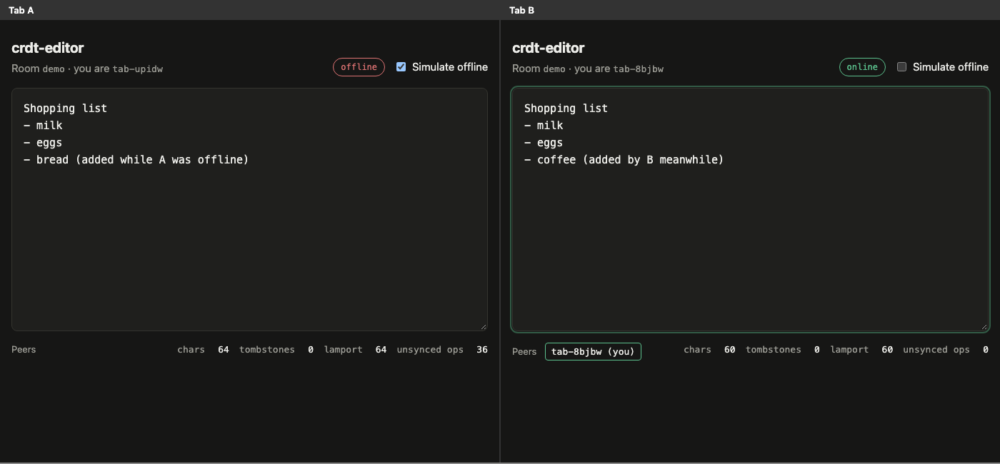
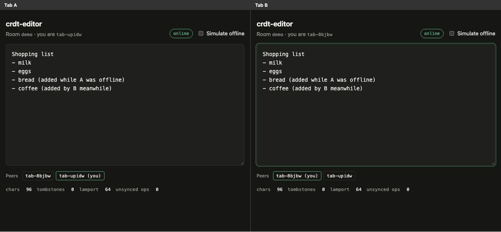

# crdt-editor

> **Credits.** Built by Amaan Mithani with Claude (Anthropic) as the AI coding assistant.

Collaborative plain-text editing built on a sequence CRDT written from scratch (no Yjs, no
Automerge). It has four parts: an RGA implementation in TypeScript, property tests that check
convergence under hostile delivery, a WebSocket relay with rooms, and a textarea client where you
can cut a tab off the network, keep typing, and watch it merge when it reconnects.

## See it running



Local run (`npm run build && npm start`), two clients (the built page loaded twice, side by side in one headless Chrome window) in the same room; the typing was scripted over the DevTools protocol. Tab A has **Simulate offline** ticked and both tabs have typed a line the other hasn't seen.



After unticking it: tab A merges the server snapshot and sends its 36 ops, and both tabs converge on the same text.

## What the CRDT buys you

Two people editing the same text concurrently will produce operations that conflict: both
insert at "position 5", or one deletes a character the other just typed next to. A central
server could serialise everything and transform positions, but that server becomes a
single point of truth you can't work without.

A sequence CRDT removes the need for that. Every character gets a globally unique, immutable
id, and edits refer to ids rather than positions. Merging is deterministic, so any two
replicas that have seen the same set of operations show the same text, whatever order the
operations arrived in and however many times each was delivered. Here that means:

- the relay only forwards messages and caches a replica for snapshots. It resolves no
  conflicts, and clients would still converge if it reordered or duplicated messages;
- a client can go offline for as long as it likes, keep editing, and merge on reconnect
  without a "conflict" dialog;
- a new client can catch up from a full-state snapshot instead of replaying history.

## The algorithm: RGA (Replicated Growable Array)

`src/crdt/rga.ts`

- **Ids.** Each character carries `[lamport, replicaId]`. Every replica keeps a Lamport
  clock. A local insert uses `++clock`, and a remote insert raises the clock to at least the
  op's counter. Ids are totally ordered by counter first, then by replica id.
- **Insert** `{t:'i', id, l, v}`: put character `v` right after the element `l` (its _left
  origin_), or at the start when `l` is null. To place it, start just after `l` and skip every
  element whose id is **greater** than the new id, then insert. Skipped elements are
  concurrent siblings that sort earlier, plus their descendants, which always carry larger
  counters than their own origin.
- **Delete** `{t:'d', id}` marks the element as a tombstone. It stays in the sequence so that
  later inserts can still use it as an origin.
- **Out-of-order delivery.** If an insert arrives before its origin, or a delete before its
  target, the op waits in a buffer keyed by the missing id and replays as soon as that id is
  integrated. Duplicate inserts are detected by id, and a repeated delete does nothing, so
  `applyRemote` is idempotent.
- **Snapshots** (`src/crdt/snapshot.ts`) hold the full state in document order, tombstones
  included. Each element takes 4 integers `[counter, replicaIdx, originCounter,
originReplicaIdx]` against a replica table. The very common "my origin is the element
  right before me" case uses the marker `-2`. The text is one string, and tombstone flags are
  run-length encoded. `merge(snapshot)` replays the snapshot as inserts and deletes, so it
  is idempotent and commutative with op-based sync.
- **Storage.** Elements live in a list of blocks of at most 128 items, and each block caches
  its visible count. An index lookup walks the blocks and then scans inside one block, so it
  costs O(n/B + B) and not O(n). A `Map` from id to element gives O(1) origin lookup.

### Worked example: two concurrent inserts at the same spot

Alice types `ac`, which creates `a = [1,alice]` and `c = [2,alice]` with origin `a`. Bob
receives both. Then, **concurrently**, they each type between `a` and `c`:

| replica | op                                             |
| ------- | ---------------------------------------------- |
| alice   | insert `X`, id `[3,alice]`, origin `[1,alice]` |
| bob     | insert `Y`, id `[3,bob]`, origin `[1,alice]`   |

The counters tie at 3, so the replica id decides: `"bob" > "alice"`, so `[3,bob]` sorts before
`[3,alice]`.

- **Alice** receives `Y`. She starts after `a`, where the next element is `X [3,alice]`, which
  is smaller than `Y`, so she stops and inserts `Y` there: `a Y X c`.
- **Bob** receives `X`. He starts after `a`, where the next element is `Y [3,bob]`, which is
  larger than `X`, so he skips it. The next element is `c [2,alice]`, which is smaller, so he
  stops: `a Y X c`.

Both replicas show `aYXc`, and neither one's intent was lost. This exact case is a unit test
(`tests/rga.test.ts`, "worked README example").

## Convergence testing

`tests/convergence.props.test.ts` uses [fast-check](https://fast-check.dev) to generate whole
editing sessions:

- 2 to 5 replicas and up to 80 actions: multi-character inserts and range deletes at random
  positions, deliveries of a random pending op (sometimes left in the inbox so it arrives
  again), and occasional state merges from one replica's snapshot into another's;
- every op is broadcast into every other replica's inbox. At the end each inbox is shuffled
  (seeded) and every message is delivered **twice**.

Properties checked:

1. **Convergence**: all replicas end with the same string, and no ops remain buffered.
2. **Deletes hit exactly their target**: every inserted character is unique, and the final
   text is exactly the inserted characters minus the ones that were deleted. A delete never
   removes a different character.
3. **Order stability**: if any replica ever showed character `x` before `y` and both survive,
   `x` is still before `y` in the final text.
4. **State-based merge**: snapshots merged in any order, and more than once, give the same
   text as op-based sync.
5. **Concurrent inserts at one position**: they end up contiguous and ordered by id, with the
   larger id first.

`npm test` runs 150 cases per property. `npm run test:props` runs **2,000 per property**
(10,000 sessions, about 2s locally). CI runs 500. I checked that the suite catches real bugs
by breaking the code on purpose: removing the skip rule broke 4 of the 5 properties, and
dropping buffered deletes broke convergence and the identity property.

## Measured

`npm run bench` writes `results/bench.json`. Headline, from the current file:

> **A 50,000-character document typed sequentially snapshots to 688,961 bytes (13.78 bytes
> per character)**. That includes ids, origins and tombstone flags. After 100k random
> edits (39,618 visible characters and 30,191 tombstones) the snapshot is 1,104,477 bytes.

The same file also records the time for 100k random local edits, for replaying them
remotely, and for merging two replicas that diverged by 10k ops each (op-based and
snapshot-based). The timings come from one wall-clock run on a machine shared with other
workloads (`loadAverage1m` is recorded next to them) and changed by 2–3× between runs, so
treat them as rough. The byte counts are deterministic.

## Running the demo (two browser tabs)

```bash
npm install
npm run build          # server -> dist/server, web client -> dist/web
npm start              # relay + static client on http://127.0.0.1:8787
```

Open `http://127.0.0.1:8787/?room=demo` in two tabs and type in both. Then:

1. Tick **Simulate offline** in tab A. The socket closes and the peer list empties.
2. Keep editing in both tabs. Tab A's "unsynced ops" counter goes up.
3. Untick it. Tab A merges the server snapshot (everything it missed) and sends every op
   the server doesn't have. Both tabs converge.

To develop with hot reload, run `npm run dev:server` and `npm run dev:web` in two terminals,
then open the Vite URL (`:5173`). The client connects to the relay on `:8787`. Rooms are
saved to `rooms.json` every 2s; set `PERSIST_PATH`, `PORT` or `HOST` to change that.

### Client mapping

The textarea's `input` event is converted into CRDT ops by diffing the previous text with
the new text, using the longest common prefix and suffix, with the caret position to settle
ambiguous cases like typing `a` into `aa` (`src/client/textDiff.ts`). One `input` event
always changes one contiguous range, so this covers typing, backspace, delete, selection
replacement, paste, cut and undo in a single path. Remote effects arrive as
`{insert|delete, index}`, and the client uses them to shift the caret and selection.

### Sync protocol (`src/sync/protocol.ts`)

- client → server: `join {room, replica, name}`, `ops {ops}`
- server → client: `welcome {snapshot, peers}`, `ops {from, ops}`, `peers {peers}`, `error`

On every (re)connect the client merges the `welcome` snapshot and then sends
`opsMissingFrom(doc, snapshot)`, meaning every local insert or delete the server's snapshot
doesn't contain. That covers the offline outbox, and also ops lost in flight when a
connection dropped or when the server restarted without persisting. A test covers each case.

## Project layout

```
src/crdt/      ids, op types, RGA, snapshot encoding
src/sync/      wire protocol + validation of untrusted client messages
src/server/    ws relay (rooms, snapshots, JSON persistence, static files) + CLI entry
src/client/    SyncClient (browser + Node) and the textarea diff helper
web/           Vite textarea client
scripts/       bench.ts
tests/         unit, server (real ws on an ephemeral port), property tests
```

## Quality gates

```bash
npm run lint && npm run typecheck && npm run format:check
npm run test:coverage   # coverage thresholds of 75% on src/ enforced in vitest.config.ts
npm run test:props      # 2,000 runs per property
npm run build
```

## Limitations

- **No tombstone garbage collection.** Deleted characters stay forever, in memory and in
  snapshots. That is 30% of the elements in the random-edit benchmark. Safe GC needs causal
  stability, meaning every replica has seen the delete, and that is out of scope.
- **Plain text only.** No rich text, formatting marks or cursors or presence beyond the peer
  list.
- **One element per UTF-16 code unit**, matching textarea indices. An emoji is two elements,
  and concurrent edits can in principle split a surrogate pair.
- **Index lookups are O(n/B + B)** with B = 128, not O(log n). A balanced tree or rope would
  be needed for very large documents. Remote integration also skips over concurrent siblings
  linearly, as RGA does.
- **Op messages are verbose JSON**, one object per character. Only snapshots are compacted.
  Neither side batches or delta-compresses.
- **The relay trusts clients.** Messages are validated for shape, but there is no auth, no
  rate limiting, and no cap on a room's buffered or pending ops. A malicious client can bloat
  a room. Persistence is a single JSON file rewritten on an interval.
- **The browser UI has no automated tests.** The logic it relies on is tested in Node against a real
  WebSocket server, and the page was checked by hand in Chrome (two tabs: live typing; one tab offline
  while both edited; reconnect converged to the same text). There's no automated browser test for
  `web/main.ts`.
